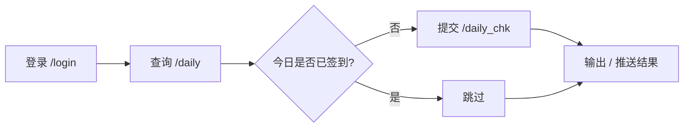

<div align="center">

# [jmComicCheckIn](https://github.com/YsKiKi/jmComicCheckIn)

**禁漫天堂（JMComic）自动签到服务**

每天自动登录禁漫天堂并完成打卡签到，支持多账号、定时执行、失败重试与多渠道通知。

[](https://www.python.org/)
[](https://www.docker.com/)
[]()
[](https://github.com/YsKiKi/jmComicCheckIn)
[](./LICENSE)

</div>

## 📖 目录

- [jmComicCheckIn](#jmcomiccheckin)
  - [📖 目录](#-目录)
  - [✨ 功能特性](#-功能特性)
  - [🚀 快速开始](#-快速开始)
  - [📦 安装](#-安装)
  - [🎮 使用](#-使用)
  - [⚙️ 配置](#️-配置)
    - [密码环境变量](#密码环境变量)
    - [通知渠道](#通知渠道)
  - [🐳 部署](#-部署)
    - [1. Docker / Docker Compose](#1-docker--docker-compose)
    - [2. Windows 任务计划程序](#2-windows-任务计划程序)
    - [3. Linux systemd（可选）](#3-linux-systemd可选)
    - [4. GitHub Actions](#4-github-actions)
  - [🛠️ 工作原理](#️-工作原理)
  - [📂 项目结构](#-项目结构)
  - [🙏 参考项目](#-参考项目)
  - [📄 许可证](#-许可证)
  - [⚠️ 免责声明](#️-免责声明)

## ✨ 功能特性

- ✅ 每日自动登录并完成打卡签到
- ✅ 多账号支持，独立配置、统一汇总结果
- ✅ 定时执行 + 随机延迟（避免规律化）+ 失败自动重试
- ✅ 多渠道结果通知：PushPlus / Server酱 / 通用 Webhook
- ✅ 密码支持 `${ENV_VAR}` 环境变量占位，避免明文入库
- ✅ 一次性 / 常驻两种运行模式，适配计划任务与 CI
- ✅ 开箱即用的 Docker / GitHub Actions / systemd 部署方案

## 🚀 快速开始

```bash
# 1. 获取代码
git clone https://github.com/YsKiKi/jmComicCheckIn
cd jmComicCheckIn

# 2. 安装依赖
pip install -r requirements.txt

# 3. 复制示例配置并填写账号
copy config.example.yml config.yml   # Windows
# cp config.example.yml config.yml   # Linux / macOS

# 4. 立即签到一次
python run.py --once
```

## 📦 安装

- 环境要求：Python 3.12+
- 安装依赖：

```bash
pip install -r requirements.txt
```

| 依赖 | 说明 |
| --- | --- |
| [jmcomic](https://github.com/hect0x7/JMComic-Crawler-Python) | 禁漫移动端 API 客户端（自动处理 token 加解密、域名更新） |
| PyYAML | 配置文件解析 |
| requests | HTTP 请求 |
| tzdata | Windows 平台时区数据 |

## 🎮 使用

| 命令 | 说明 |
| --- | --- |
| `python run.py --once` | 立即签到一次后退出（适合计划任务 / GitHub Actions） |
| `python run.py` | 常驻运行，每天按 `schedule.time` 自动签到 |
| `python run.py --test-notify` | 发送测试通知，验证通知配置 |
| `python run.py --once -v` | 调试模式，输出详细日志 |

命令行参数：

| 参数 | 简写 | 说明 |
| --- | --- | --- |
| `--config` | `-c` | 配置文件路径，默认 `./config.yml` |
| `--once` | — | 只签到一次后退出 |
| `--test-notify` | — | 发送一条测试通知并退出 |
| `--verbose` | `-v` | 输出调试日志 |

> `--once` 模式下签到失败时进程退出码为 `1`，方便配合任务系统做失败告警。

## ⚙️ 配置

复制 `config.example.yml` 为 `config.yml` 并填写账号：

```bash
copy config.example.yml config.yml     # Windows
cp config.example.yml config.yml       # Linux / macOS
```

```yaml
accounts:
  - name: 主账号              # 可选，用于日志与通知中的标识
    username: your_username   # 禁漫天堂用户名
    password: "${JM_PASSWORD}" # 密码；支持 ${环境变量} 占位

schedule:                     # 常驻模式生效；--once 模式忽略
  time: "08:00"               # 每天签到时间，24 小时制
  timezone: "Asia/Shanghai"   # 时区（IANA 名称），默认北京时间
  jitter_seconds: 300         # 随机延迟 0~300 秒后再签到
  run_on_start: true          # 服务启动时立即签到一次
  retry_interval_minutes: 30  # 签到失败后的重试间隔（分钟）
  max_retries: 2              # 失败后最多重试次数

notify:                       # 可选：签到结果通知（不配置则不推送）
  - type: pushplus
    token: "你的pushplus token"
```

完整配置项说明见 `config.example.yml` 内注释。

### 密码环境变量

密码支持 `${ENV_VAR}` 环境变量占位，避免明文保存：

```bash
# Windows PowerShell
$env:JM_PASSWORD="你的密码"
python run.py --once

# Linux / macOS
export JM_PASSWORD="你的密码"
python run.py --once
```

若占位符未能解析，服务会直接报错并退出，不会把字面量发给服务器。

### 通知渠道

| 渠道 | `type` | 字段 | 文档 |
| --- | --- | --- | --- |
| PushPlus | `pushplus` | `token` | <https://www.pushplus.plus> |
| Server酱 | `serverchan` | `sendkey` | <https://sct.ftqq.com> |
| 通用 Webhook | `webhook` | `url` | POST JSON `{title, content}` |

## 🐳 部署

### 1. Docker / Docker Compose

```bash
docker compose up -d    # 常驻模式，每天自动签到
```

### 2. Windows 任务计划程序

```powershell
schtasks /Create /TN "JMCheckIn" /TR "python D:\路径\run.py --once --config D:\路径\config.yml" /SC DAILY /ST 08:00
```

### 3. Linux systemd（可选）

```ini
[Unit]
Description=JM Comic check-in service
After=network-online.target

[Service]
Type=simple
WorkingDirectory=/opt/jmComicCheckIn
ExecStart=/usr/bin/python3 run.py --config /opt/jmComicCheckIn/config.yml
Restart=always

[Install]
WantedBy=multi-user.target
```

### 4. GitHub Actions

Fork [YsKiKi/jmComicCheckIn](https://github.com/YsKiKi/jmComicCheckIn) 后，在仓库 `Settings → Secrets and variables → Actions` 中配置以下 Secrets：

| Secret | 必填 | 说明 |
| --- | --- | --- |
| `JM_USERNAME` | ✅ | 禁漫天堂用户名 |
| `JM_PASSWORD` | ✅ | 禁漫天堂密码 |
| `PUSHPLUS_TOKEN` | 可选 | PushPlus 通知 token |

工作流程 `.github/workflows/jm-checkin.yml` 会每天北京时间 08:00（UTC 0:00）自动执行签到，也可在 Actions 页面手动触发。Secrets 通过 job 级环境变量注入，运行时替换 `config.yml` 中的 `${VAR}` 占位符。

## 🛠️ 工作原理

- 登录与接口调用基于 [JMComic-Crawler-Python](https://github.com/hect0x7/JMComic-Crawler-Python)（`jmcomic`）的移动端 API 客户端：
  - 自动处理 APP 接口的 `token` / `tokenparam` 加解密；
  - 自动更新最新 API 域名、自动携带 cookies，无需对抗 Cloudflare。
- 签到接口路径参考 [JMComic-qt](https://github.com/tonquer/JMComic-qt) 客户端实现：

| 接口 | 方法 | 说明 |
| --- | --- | --- |
| `/login` | POST | 登录，返回 `uid` 与 `s`（即 AVS cookie） |
| `/daily?user_id={uid}` | GET | 查询当月签到记录，返回 `daily_id` |
| `/daily_chk` | POST | 提交签到，参数 `user_id`、`daily_id` |

工作流程：



## 📂 项目结构

```
jmComicCheckIn/
├── run.py                             # 入口脚本（等价于 python -m jm_checkin）
├── config.example.yml                 # 配置示例（复制为 config.yml 使用）
├── requirements.txt                   # 依赖清单
├── LICENSE                            # MIT 许可证
├── Dockerfile                         # Docker 镜像构建
├── docker-compose.yml                 # Compose 一键部署
├── .github/workflows/jm-checkin.yml   # GitHub Actions 定时任务
└── jm_checkin/
    ├── __main__.py                    # python -m jm_checkin 入口
    ├── cli.py                         # 命令行参数与入口
    ├── config.py                      # 配置加载（支持环境变量占位）
    ├── client.py                      # 登录 + 签到接口封装（基于 jmcomic）
    ├── service.py                     # 一次性执行 / 常驻定时守护
    └── notify.py                      # PushPlus / Server酱 / Webhook 通知
```
## 🙏 参考项目

- [hect0x7/JMComic-Crawler-Python](https://github.com/hect0x7/JMComic-Crawler-Python)（[MIT License](https://github.com/hect0x7/JMComic-Crawler-Python/blob/master/LICENSE)）—— 禁漫移动端 API 客户端（`jmcomic`），本项目通过 pip 依赖引入
- [tonquer/JMComic-qt](https://github.com/tonquer/JMComic-qt)（[LGPL-3.0 License](https://github.com/tonquer/JMComic-qt/blob/main/LICENSE)）—— 禁漫客户端，本项目仅参考其签到接口路径，未包含其代码

## 📄 许可证

本项目采用 [MIT License](./LICENSE)。

- 依赖库 [jmcomic](https://github.com/hect0x7/JMComic-Crawler-Python) 使用 [MIT License](https://github.com/hect0x7/JMComic-Crawler-Python/blob/master/LICENSE)，与 MIT 完全兼容；
- 签到接口仅参考 [JMComic-qt](https://github.com/tonquer/JMComic-qt)（[LGPL-3.0](https://github.com/tonquer/JMComic-qt/blob/main/LICENSE)）的接口实现思路，本项目未包含其任何代码，不受 LGPL 传染条款约束。

## ⚠️ 免责声明

本项目仅供学习交流使用，请勿用于任何违反平台服务条款的行为；使用本项目产生的一切后果由使用者自行承担。
